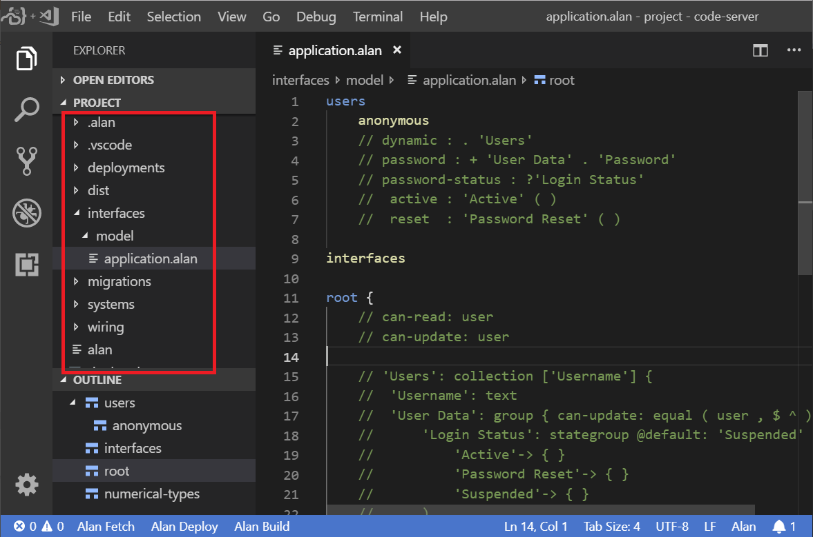
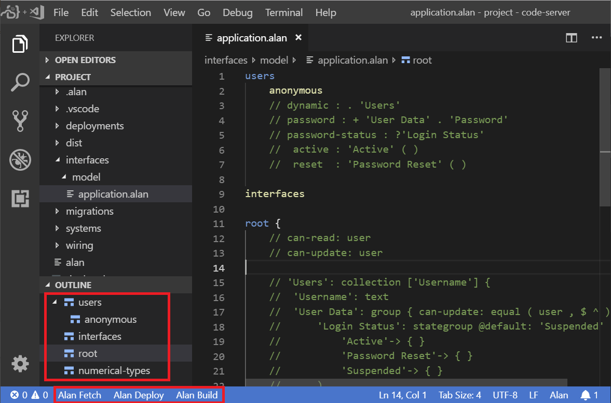

> Take a look at the [Reference Guide](reference.html) for an overview of the bits, pieces and commands used throughout this tutorial. 

In this tutorial we'll take you through the steps going from a blank model to a little "Hello World" application. 

To get you up and running we've created a project template. The build system we're going to use expects a layout with files and folders in a particular structure, and this template sets you right on track for anything but the more complicated things you can build with Alan (like connecting to external databases).

Several steps involve entering commands on a Unix-like command line. Use whatever you like on Linux or macOS (as long as bash is available). On Windows you can use [WSL](https://docs.microsoft.com/en-us/windows/wsl/about) or [Git Bash via Git For Windows])(https://gitforwindows.org), as long as you don't mix the two.

## Project Layout

You'll notice some top level directories here.

- deployments
  Contains environment specific configuration like IP addresses, in addition to stuff that will be different from one deployment to another like your datasets.
- interfaces
  In Alan systems talk to each other over interfaces. For instance, the client talks to the server over an interface defined by the application model. 
- migrations
  Data needs to match the application model specification. Unlike relational databases, the model drives the entire application and will often change between versions of your application. Migrations help you move your data from one version to another. 
- systems
  Contains the configuration of each system that will be running for your project. Most projects have a server, a client and a reporter. 
- wiring
  Defines how the systems and interfaces are wired together. For most projects the default here already defines everything you need, but if you want to add custom clients or external databases this is where you describe how they're connected.

For now, you can ignore deployments, migrations, systems and wiring. We'll touch on them later, but we've got defaults set up there that will work for most basic projects. 

Firstly, lets take a look at the application model. As we said earlier, it drives everything and this file is the one you'll spend most time editing.

## Application Model

Open the application.alan file in an editor. We're be using Sublime Text in the screenshots, but [you can use whatever you like](https://github.com/M-industries?utf8=✓&q=AlanFor). 

The template already has a little model set up that covers some basics. Let's walk through it before we wipe it clean and start our own.

The model is a nested data structure not unlike [JSON](https://json.org). At the first level you'll see some keywords:
- [users](https://github.com/M-industries/AlanProjectTemplate/blob/bb862edd3be27df167400cbbc405aa3509d47da4/interfaces/model/application.alan#L1)
  There is some boiler plate here that currently allows anonymous users (you can use the application without logging in). To use user accounts, uncomment the other lines that point to a "Users" collection and the "Password" property in it.
- [roles](https://github.com/M-industries/AlanProjectTemplate/blob/bb862edd3be27df167400cbbc405aa3509d47da4/interfaces/model/application.alan#L6)
  Permissions are currently (we're working a completely revised system) set using roles. Users are assigned to roles to give them read and/or write access to parts of the data.
- [root](https://github.com/M-industries/AlanProjectTemplate/blob/bb862edd3be27df167400cbbc405aa3509d47da4/interfaces/model/application.alan#L12)
  This is where your model really starts. Note the basic read and write permissions that are set here.
- [numerical-types](https://github.com/M-industries/AlanProjectTemplate/blob/bb862edd3be27df167400cbbc405aa3509d47da4/interfaces/model/application.alan#L55)
  Numbers have types, like "date" or units like "kg". Number types can be converted between for calculations (e.g. to get "meters per second") etc. We'll get to that later.

So, in "root", you describe the data model of your application. You do so by combining properties of certain types. Essentially there are 4 data types in Alan:
- number (integer or natural)
  Numbers are things you can count, or do math with. [Dates and date-time values](https://github.com/M-industries/AlanProjectTemplate/blob/bb862edd3be27df167400cbbc405aa3509d47da4/interfaces/model/application.alan#L42) are numbers too. Numbers are usually an integer, or a natural when they can't be zero or negative. Alan doesn't know floats, so how that works with division etc. we'll cover later.
- text
  Text is mostly just text, e.g. "Name", or any other value that doesn't adhere to any rules. So [phone numbers](https://github.com/M-industries/AlanProjectTemplate/blob/bb862edd3be27df167400cbbc405aa3509d47da4/interfaces/model/application.alan#L33) are `text`, not `number`.
  You *can* put some [input rules](/pages/docs/model/33/application/grammar.html#node) on text for the user interface, e.g. minimum length or a specific pattern.
  Text can also refer to an [entry in another collection](https://github.com/M-industries/AlanProjectTemplate/blob/bb862edd3be27df167400cbbc405aa3509d47da4/interfaces/model/application.alan#L49) (you can think if it as a "foreign key").
- collection
  You could (but [shouldn't](https://en.wikipedia.org/wiki/Graph_database) 😉 ) think of these as your tables. If you want to describe a bunch of "things" that are mostly the same, e.g. "Contacts", that's a collection.
  Keys in a collection are just like a text property, but they're implicit (this is likely to change in the near future). So, keys can also refer to keys in another collection. 
- stategroup
  [State groups](https://github.com/M-industries/AlanProjectTemplate/blob/bb862edd3be27df167400cbbc405aa3509d47da4/interfaces/model/application.alan#L39) are where it gets really interesting: they represent a choice. With this things in one state have slightly different properties from things in another state. E.g. road bikes and fixies are both bikes, but one has gears and shifters, whereas the other doesn't.

There is a fifth type called "group", which is just a construct to create (visual) grouping and name spaces: groups don't actually hold any data by themselves.

## Run It

Well, that's a lot of information. Let's skip to the fun part until we get back to making models and actually boot up this example project.

The workflow here is that you've got a server running somewhere (on your system, available on the network, or in cloud) and you upload your application to it. The server then runs the application and you can then use it via your webbrowser.

### Get the server 
On macOS and Linux you can [run the server](https://alan-platform.com/docs/#get-the-alan-server) from the command line, here we'll use a virtual machine to run it. 

- Get [VirtualBox](https://www.virtualbox.org/wiki/Downloads) for your "host" (i.e. the system you're using) OS.
- Get our [server "appliance"]().

Double click the Alan.ova appliance package to install it into VirtualBox, it has all the configuration already set up to Just Work™. Then just hit the green Start button. When it's done going through the boot sequence it will report the IP address and port number (probably 8888) you can use to connect to it.

### Connect to the server
On macOS and Linux you can connect to the server from the command line using `./alan connect`, here we'll use a virtual machine to run it. 

- Get the [Alan Connect]() application.
- Start it
- Enter the server's ip address and port (ip:port, e.g. 192.168.1.1:8888).

Now everything server-side is set up to receive our application. 

## Build It 

Let's get ready to build the application so we can run it. The project holds the source code, but it needs to be compiled before the server can use it. There are a few step to this:

- Open your command line of choice (see the note at the start of this article) at the root directory of your project.
- Run the following commands:
  - `./alan bootstrap`
  - `./alan build`
  - `./alan build -C migrations`
  - `cp dist/from_scratch.migration deployments/default/instances/server.migration`
  - `./alan package dist/project.pkg deployments/default`

This puts a default.image file in the dist folder (all output is put in the dist folder by default). You can drag that file to the Alan Connect application and it'll upload it to the server. Once that's done you'll see the application listed and you can hit the green "Start" button to start it. 🍾!

You can now open a webbrowser and go to the ip address of the server, followed by the port the client is available on. How that works we'll talk about in the section about deployment, for now you can go to:

http://<serverip>:7584 

Topics to cover:
- deployment
- permissions
- derivations
- basic number conversion, division and rounding
