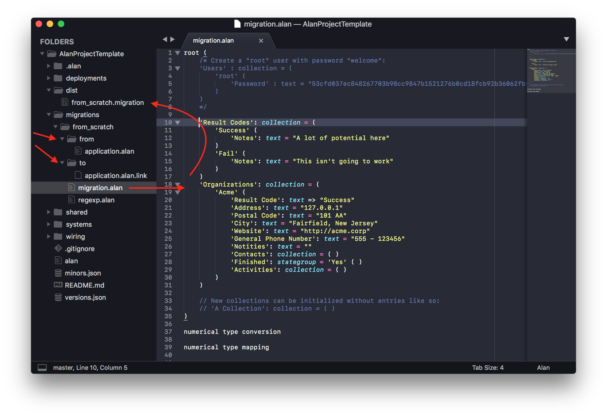
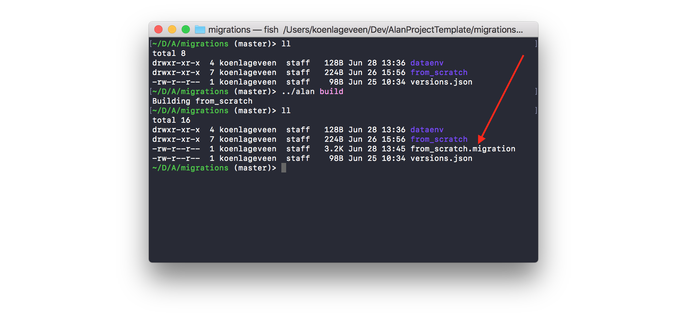

## Creating an initial data set

To start a server system, you need to feed it a valid initial dataset. To get that dataset, we're going to define a dataset using a migration.

First build your project. This ensures you have a working application model to migrate to.

In the template project we already set up a basic "from scratch" migration in the "migrations" folder. We'll continue working in that directory.

You'll notice two other folders, "to" and "from", which should contain the application models you're migrating between. "To" represents the current model, so it contains a file "application.alan.link" with a path to the model. 
"From" represents an empty data set, so the "application.alan" file there has only the basic layout.



We can check our set up here works by running `alan build`. If it works it creates a new "from_scratch.migration" package file.



Now we're ready to start modifying the migration.alan file. In this file you map existing data to your new model, or set static values for each property. In this case we don't have any data, so we're setting static values. 

The template project defines initial entries and their values for the `Result Codes` and `Organizations` collections. You can try modifying those values to get a feel for it. 

The migration language is part of the datastore system and its documentation can be found [here](http://127.0.0.1:4000/docs/#important-languages).

## Users

You can create as much data as you want, but usually it's easier to leave all collections empty. E.g `'Years': dictionary = { }`. Depending on the complexity and structure of your model, you probably end up with a very small migration.

If your model has users, you will need a first user to get into the application at all. To create this first user, we initialize the Users dictionary with a single entry "root", with the password "welcome". The following command provides us with the hashed (and lightly salted) password string:
```sh
echo -n "rootwelcome" | shasum -a 256
```

The resulting initial Users dictionary for the Hours application looks like this:
```js
'Users' : dictionary = {
  'root' {
    'Contracts' : dictionary = { }
    'Name' : text = ""
    'Password' : text = "53cfd037ec848267703b98cc9847b1521276b0cd18fcb92b36062fbf96a70b45"
    'Roles' : group = {
      'Employee' : stategroup = 'Yes' { }
      'Manager' : stategroup = 'Yes' { }
      'Project Manager' : stategroup = 'Yes' { }
      'Reviewer' : stategroup = 'Yes' { }
    }
  }
}
```

## Dry run

To test your migration in a "dry run", run the migration engine on a dataset (e.g. the one in the default deployment):

```sh
mkdir from_scratch/data/ && \
./dataenv/system-types/datastore/tools/migration-engine from_scratch.migration < ../deployments/default/instances/server/instance.json > from_scratch/data/out.json
```
