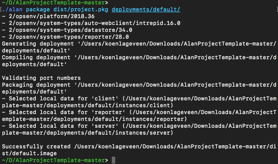

If you're new to Alan, try the "Alan 101" tutorial: [Getting Started](/pages/tuts/getting-started.html). It's the best way to learn how to use the Alan language and related tools. 

This page will cover some of the details of how things work.


## Using the Alan utility
Central to working with Alan is the [accompanying command line utility](/docs/#get-the-alan-utility). This uses some Unix features like `bash` and `curl` to help you run the compilers and get your project up and running. 

Linux and macOS come with a command line environment that will run all of Alan natively.

On Windows you can use the MinGW terminal (aka. Git Bash) provided by [Git-For-Windows](https://gitforwindows.org).

The Alan runtime only runs on a "real" Unix-like system. We recommend using our [VirtualBox appliance](/docs/#get-the-alan-server) to develop Alan applications on Windows.


## Starting a new application

Download the Project Template from the [home page](/): [AlanProjectTemplate](https://github.com/M-industries/AlanProjectTemplate/archive/master.zip), or fork it on [GitHub](https://github.com/M-industries/AlanProjectTemplate).

Unzip it and open a command line in the new directory. To get started, we're going to run some commands:

1. `./alan bootstrap`
2. `./alan build`
3. `./alan build -C migrations`
4. `cp dist/from_scratch.migration deployments/default/instances/server.migration`
5. `./alan package dist/project.pkg deployments/default`

The bootstrap command is used only initially. Building and copy-ing the migration is only necessary when you make change to the migration. 

> Tip: put steps 2-5 in a script.


## Modifying applications
The template contains a basic application. To modify it, open `interfaces/model/application.alan`. Be sure to run `./alan build` to validate your changes, and `package` when you're ready to try to run the application.


## Data migration
The migration.alan in migrations/from_scratch describes the initial dataset. Read more about migrations [here](/pages/tuts/migration.html).

To build the migrations, run `../alan build` from the migrations directory or `./alan build -C migrations` from the root of your project.

This will produce a `from_version_x.migration` package (all output can be found in the "dist" directory) that can be used in a deployment. To do so, copy it to the deployment. In a basic project the location would be `deployments/default/instances/server.migration`:

```sh
cp dist/from_scratch.migration deployments/default/instances/server.migration
```

## Starting a server from the command line

> On Windows use the [VirtualBox appliance](/docs/#get-the-alan-server)

When you start the server, it will create several directories and download some dependencies. Therefore it's best to run a server in a dedicated directory.  
In WSL you need to run the server inside the Linux file system, for instance in `~`.

- `mkdir server`
- `cd server`
- Linux:
  - ```
bash -c "mkdir -p data runenv/image && curl -s https://dist.m-industries.com/share/image/image-11-linux-x64.tar.gz | tar xzf - -C runenv/image && ln -s runenv/image/application-server serve"
```
- macOS
  - ```
bash -c "mkdir -p data runenv/image && curl -s https://dist.m-industries.com/share/image/image-11-darwin-x64.tar.gz | tar xzf - -C runenv/image && ln -s runenv/image/application-server serve"
```
- `./serve 127.0.0.1 12345`


## Upload to the server from the command line

> On Windows use the [Alan Connect app](/docs/#get-the-alan-connect-management-app)

Upload an image to the server:

- `./alan connect 127.0.0.1 12345 upload "demo" dist/default.image`

You're now in a dialog session with the server. To start your application, issue the `start` command.
If this is successful you can now end the session by issuing the `exit` command, the application will continue running.



To upload a new version of the application, use the `--batch replace` command:

- `./alan connect 127.0.0.1 12345 --batch replace "demo" dist/default.image`

To stop the application, but keep the server running, connect to your application and issue the stop command.

- `./alan connect 127.0.0.1 12345 select "demo"`
- `stop`

To stop the server, you can switch to the terminal window where the server is running and hit `CTRL + C`. 


## Open the application in a browser

The client is hosted on the server (if you run the server locally that's `localhost` or `127.0.0.1`), at a specific [port](https://en.wikipedia.org/wiki/Network_port). This port is defined in the [deployment.alan file](https://github.com/M-industries/AlanProjectTemplate/blob/master/deployments/default/deployment.alan#L20). For out application template this port is number 7584. So, in most cases you can browse to the following URL to use your application:

[http://localhost:7584](http://localhost:7584)
