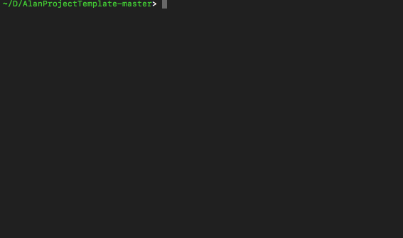

Download the Project Template from the [home page](/): [AlanProjectTemplate](https://github.com/M-industries/AlanProjectTemplate/archive/master.zip), or fork it on [GitHub](https://github.com/M-industries/AlanProjectTemplate).

Unzip it and open a command line in the new directory. To get started, we're going to run some commands:

1. `./alan bootstrap`
2. `./alan build`
3. `./alan build -C migrations`
4. `cp dist/from_scratch.migration deployments/default/instances/server.migration`
5. `./alan package dist/project.pkg deployments/default -f minors.json`

The bootstrap command is used only initially. Building and copy-ing the migration is only necessary when you make change to the migration. 

> Tip: put steps 2-5 in a script.




## Modifying applications
The template contains a basic application. To modify it, open `shared/model/application.alan`. Be sure to run `./alan build` to validate your changes, and `package` when you're ready to try to run the application.


## Data Migration
The migration.alan in migrations/from_scratch describes the initial dataset. Read more about migrations [here](/pages/tuts/migration.html).

To build the migrations, run `../alan build` from the migrations directory or `./alan build -C migrations` from the root of your project.

This will produce a `from_version_x.migration` package (all output can be found in the "dist" directory) that can be used in a deployment. To do so, copy it to the deployment. In a basic project the location would be `deployments/default/instances/server.migration`:

```sh
cp dist/from_scratch.migration deployments/default/instances/server.migration
```

## Running an image on the server
Servers only run on Linux or macOS. On Windows, you can use WSL. 

Start a server on Linux or Windows/WSL:

- `cd ~`
- `mkdir server`
- `cd server`
- `bash -c "mkdir -p data runenv/image && curl -s https://alan-platform.com/utils/latest/linux-x64/application-server.tar.gz | tar xzf - -C runenv/image && ln -s runenv/image/application-server serve"`
- `./serve 127.0.0.1 12345`

Start a server on macOS:

- `cd ~`
- `mkdir server`
- `cd server`
- `bash -c "mkdir -p data runenv/image && curl -s https://alan-platform.com/utils/latest/darwin-x64/application-server.tar.gz | tar xzf - -C runenv/image && ln -s runenv/image/application-server serve"`
- `./serve 127.0.0.1 12345`


The server will keep using the terminal while it's running so, for the next steps continue in a new terminal window.

Upload an image to the server:

- `./alan connect 127.0.0.1 12345 upload "demo" dist/default.image`

You're now in a dialog session with the server. To start your application, issue the `start` command.
If this is successful you can now end the session by issuing the `exit` command, the application will continue running.


To upload a new version of the application, use the `--batch replace` command:

- `./alan connect 127.0.0.1 12345 --batch replace "demo" dist/default.image`

To stop the application, but keep the server running, connect to your application and issue the stop command.

- `./alan connect 127.0.0.1 12345 select "demo"`
- `stop`

To stop the server, you can switch to the terminal window where the server is running and hit `CTRL + C`. 
